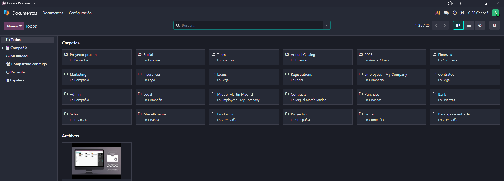
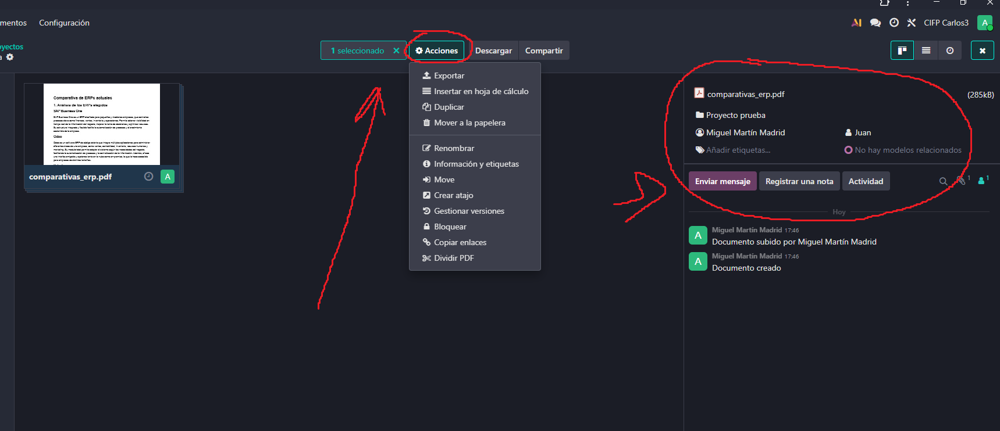
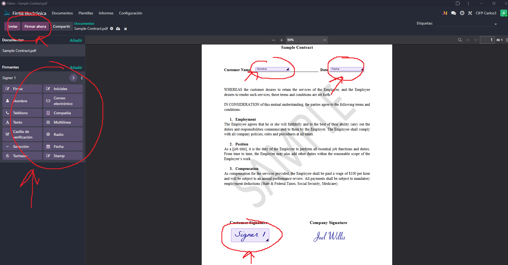
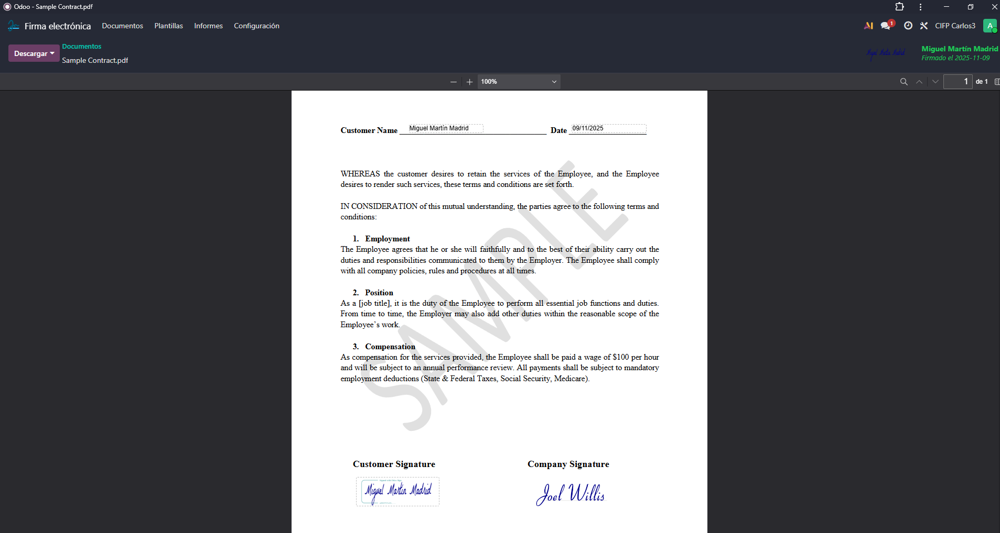
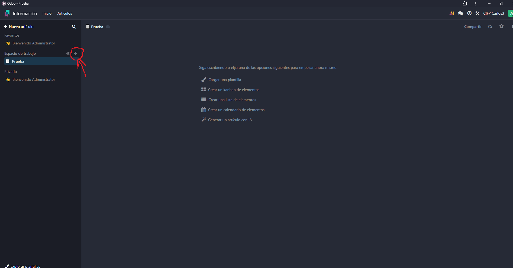
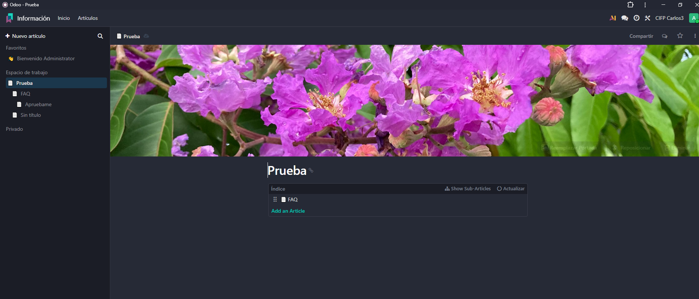
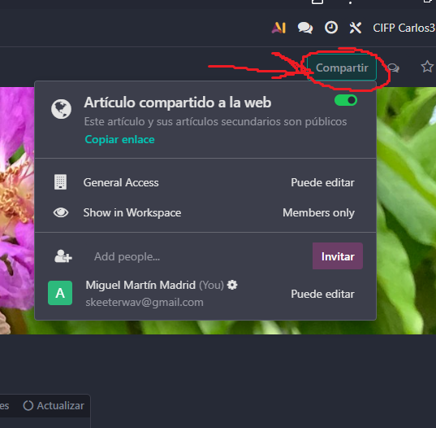
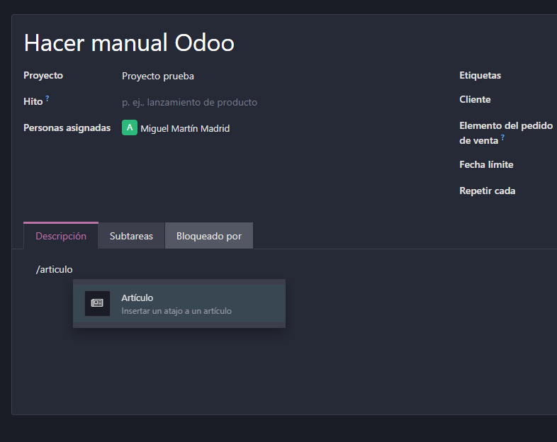

# 09 — Documentos, Firma e Información (Knowledge)

## Documentos

El módulo de Documentos tiene como objetivo digitalizar todos los documentos de la empresa para no tener que estar peleándose con papeles todo el rato.  

Podemos tener documentación de proyectos, módulos o empleados. Cuenta con integración con hojas de cálculo propias de Odoo, podemos comprobar quién ha hecho modificaciones y se unifica la información.  

  

A los documentos se le pueden asignar etiquetas o usuarios, y también que tipo de documento es, como se va a utilizar y programar actividades a través de ese documento.  

  

## Firma electrónica

Dentro de la aplicación firma electrónica podemos abrir un archivo y rellenarlo con campos como la firma o el nombre y se podrá firmar y enviar a clientes o quien sea.  

  

Si le damos a firmar ahora simplemente rellenamos los campos y podremos descargar el documento firmado electrónicamente. La firma puede ser automática hecha por Odoo o podemos cargar una firma o dibujarla a mano.  

  

## Información

El módulo Información funciona como una base de reconocimiento. Esto es importante porque a día de hoy a las empresas les interesa tener junta toda su información relevante tanto a nivel interno como externo, como guías o documentación. Lo primero que tenemos que hacer es crear un espacio de trabajo.  

  

Podemos ir anidando archivos y con el slash (/) meterle títulos, índices y otras cosas

  

Podemos compartir como enlace web lo que hemos creado dándole al botón de Compartir, pudiendo ajustar la visibilidad, o si queremos que sea privado podemos compartirselo a usuarios de nuestro Odoo.  

  

También podemos vincular esta wiki en las tareas de los proyectos que hemos creado.  

