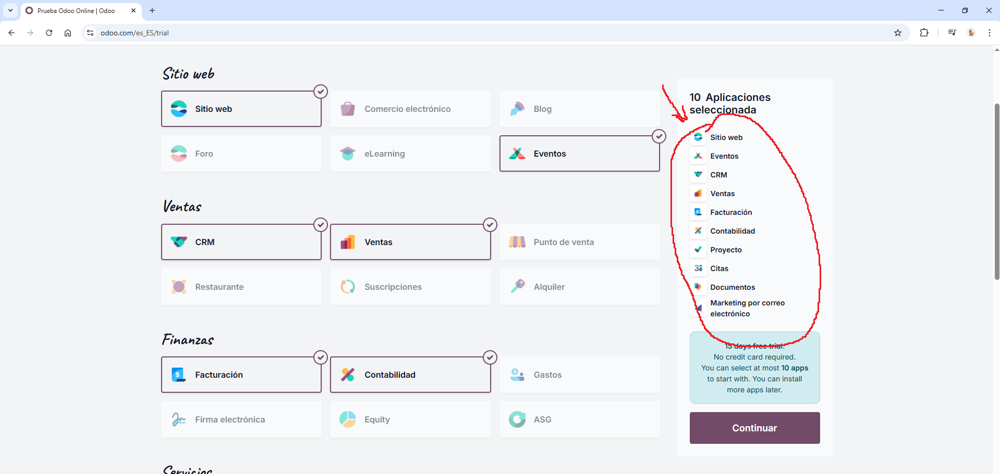
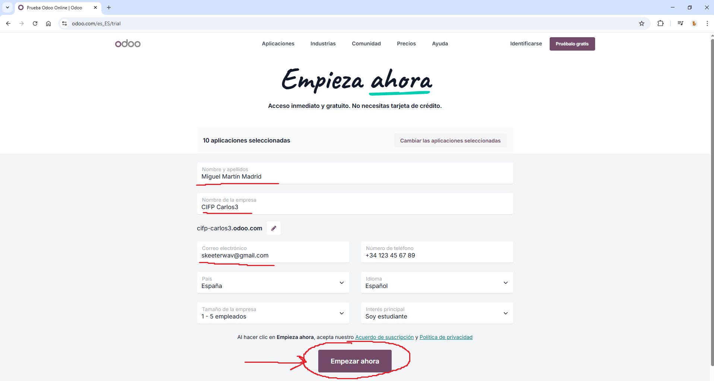
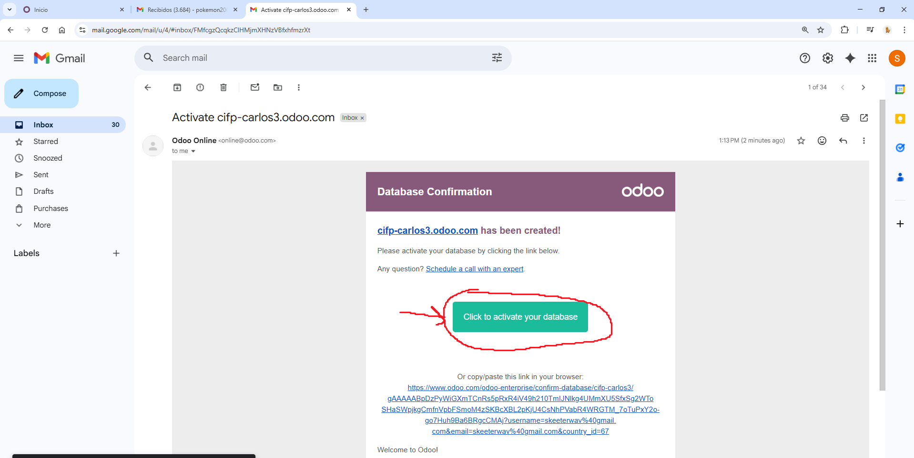
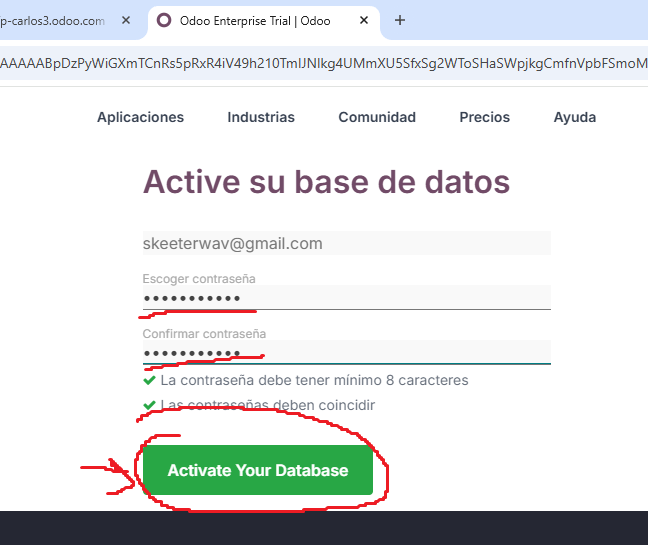
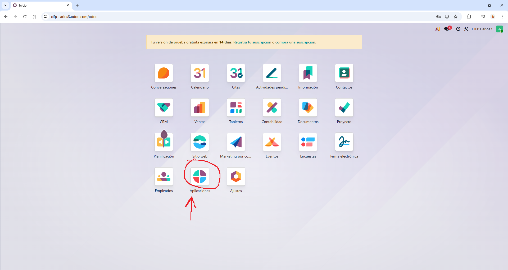
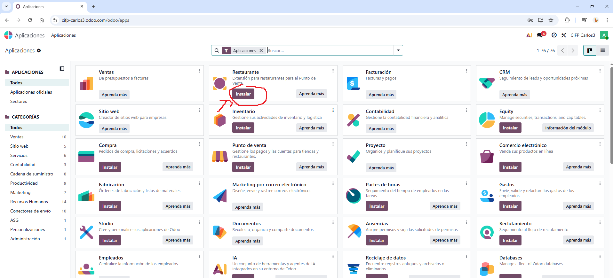
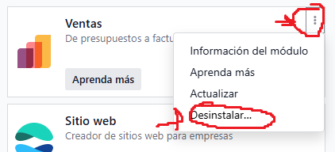

# 03 — Instalación y prueba

## Requisitos previos

- Navegador actualizado.
- Cuenta de correo para alta.

## Pasos

1. **Crear base de datos de prueba (15 días)**

Lo primero que vamos a hacer es entrar a la página web de Odoo. Una vez dentro, iremos a la pestaña de precios.  

  

Aquí veremos tres opciones. En nuestro caso vamos a hacer la prueba del Estándar. Damos click a Pureba Gratuita  

  

2. **Seleccionar apps iniciales** 

A continuación nos saldrán las apps iniciales para elegir. En la prueba gratuita se pueden elegir hasta 10. En nuestro caso elegiremos:  

- Sitio Web
- Eventos
- CRM 
- Ventas
- Facturación
- Contabilidad
- Proyecto
- Citas
- Documentos
- Marketing por Correo Electrónico

Una vez seleccionadas damos a continuar.  

  

Rellenamos con nuestra información y le damos a empezar ahora.  

  

3. **Activar base de datos**

Lo próximo que saldrá es una oferta haciendo spam que podemos omitir, y una vez omitida nos saldrá nuestro panel de control de la base de datos con todas nuestras aplicaciones.  

Podemos observar que nos dice que tenemos que confirmar nuestra base de datos o expirará en 3 horas.  

  

En el correo electrónico que hemos introducido debería haber llegado un correo donde podemos hacer click para activar la base de datos.  

  

Cuando le demos click nos pedirá una contraseña, una vez introducida le damos a activar.  

  

Si volvemos al panel de control y vemos que dice que la prueba gratuita expirará en 14 días es que lo hemos hecho bien y la base de datos está activada.  

  

4. **Instalar/Desinstalar apps**

Para administrar las aplicaciones que tenemos en nuestra base de datos podemos darle a la opción Aplicaciones  

  

Una vez dentro de la sección de aplicaciones podemos buscar aplicaciones en la barra de búsqueda o explorarlas por categorías a la izquierda.  

  

Para instalar aplicaciones es tan sencillo como buscar la aplicación que queremos y hacer click en instalar. No tiene pérdida.  

  

Por último, para desinstalar aplicaciones le damos a los 3 puntitos de la aplicación que queramos desinstalar y le damos a la opción de desinstalar.

**Ojo:** Puede ser peligroso desinstalar aplicaciones porque al estar integradas unas con otras podemos cargarnos todo el sistema fácilmente y podemos perder los datos relacionados a esa aplicación.

  