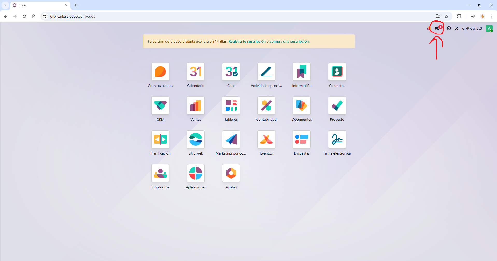
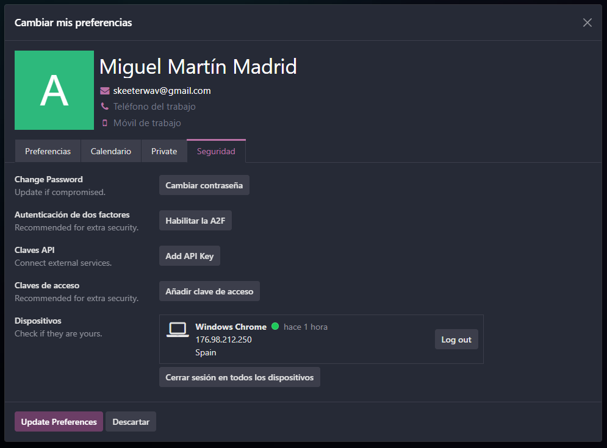
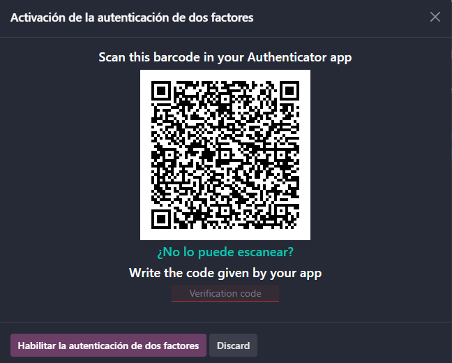
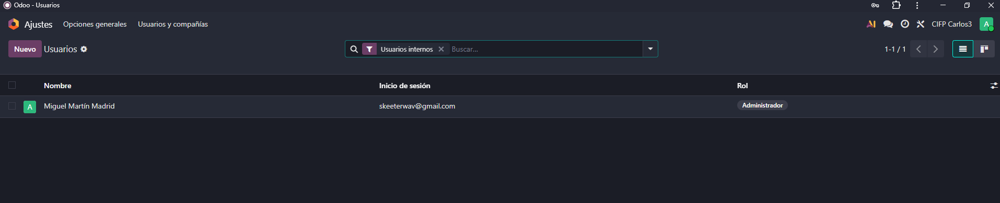
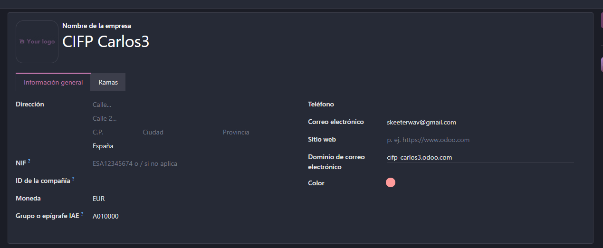
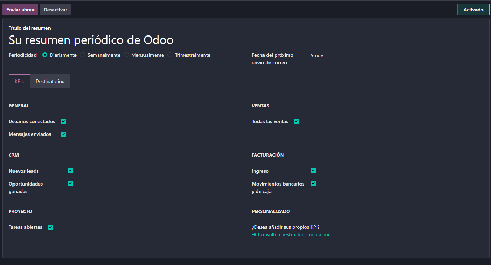

# 04 — Ajustes generales

## Activar notificaciones y PWA

Para activar las notificaciones vamos a hacer click en el icono con dos burbujas de diálogo en la parte superior derecha de la pantalla.  

  

Aqui nos van a salir varias cosas, primero le vamos a ddar a habilitar en el mensaje de activar las notficaciones. Opcionalmente podemos descargar Odoo como PWA en el botón donde dice Instalar Odoo.  

  

## Preferencias de perfil

Para editar las preferencias de perfil vamos a darle al icono en la esquina superior derecha que representa nuestro perfil, e iremos a la pestaña My Preferences.  

  

Aqui podemos hacer varias cosas, como cambiar el tema de claro oscuro, cambiar si las notificaciones nos llegan al correo o a Odoo o la firma de los correos electrónicos.  

  

En la sección Private podemos introducir datos personales como la dirección, correo electrónico privado y teléfono privado e información sobre contacto de emergencia.  

  

En la sección de seguridad podemos cambiar la contraseña, habilitar la autenticación de dos factores, añadir claves api o claves de acceso y ver en que dispositivos estamos logeados.

**Importante activar la autenticación de dos factores (2FA) por cuestiones de seguridad**  

  

Para activar la 2FA nos pedirá nuestra contraseña y luego saldrá un QR para escanearlo con el autenticador de móvil. Al escanearlo, el autenticador nos dará un código para introducirlo y se activará la 2FA.  

  

## Usuarios y compañías

Para abrir los ajustes de usuarios y compañías desde el panel de control abrimos la App que se llama Ajustes.  

  

En la pestaña de ajustes, en la esquina superior izquierda le vamos a dar a Usuarios y compañías.  

  

En los ajustes de usuario podemos ver todos los usuarios de nuestra base de datos, editar sus permisos, añadir nuevos usuarios o modificar datos de los usuarios existentes.  

**Ojo:** En Odoo se paga por cada usuario, asi que si vas a añadir un usuario nuevo tendrás que activar una suscripción para que pueda usarlo.  

**Ojo:** Es recomendable crear distintos roles para cada nivel de acceso de cada módulo, por ejemplo: para el módulo de ventas tendríamos un rol que solo pueda acceder a sus documentos propios y un rol que pueda acceder a todos los documentos. De esta manera podemos manejar mucho más fácilmente los permisos de cada usuario que si los editamos manualmente uno por uno, cosa que puede suponer un gasto de tiempo y llegar a ser complicado en una empresa con muchos empleados.  

  

  

En los ajustes de compañías podemos ver y modificar los datos de nuestra compañía. Podemos tener más de una compañía en la misma base de datos de forma totalmente separada.  

  

  

## Idiomas y diseño de documentos

Dentro de la pestaña de opciones generales tenemos opciones tanto de Odoo como de cada módulo. Entre las opciones de Odoo que nos pueden interesar están la de añadir idiomas y cambiar el diseño de las facturas.  

  

## Emails de resumen  

Una de las opciones más importantes es la de modificar los correos eléctronicos de resumen. Para acceder a ella, en la sección de Correos electrónicos damos click en Configurar correos electrónicos de resumen.  

  

Aquí podemos añadir más correos de resumen y modificarlos según la información que queremos obtener, los destinatarios y cada cuanto tiempo queremos que sean enviados.  

  