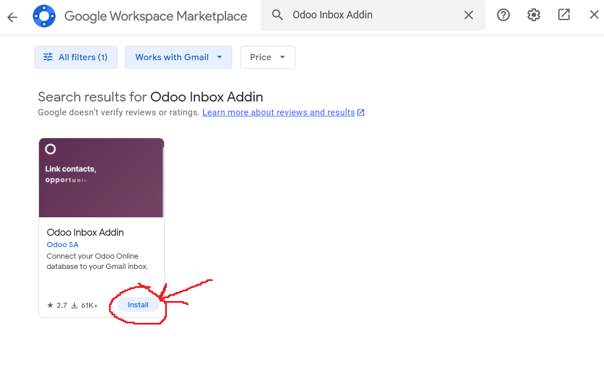
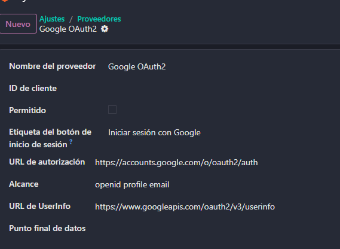
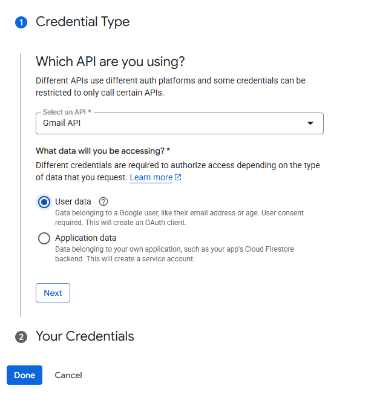
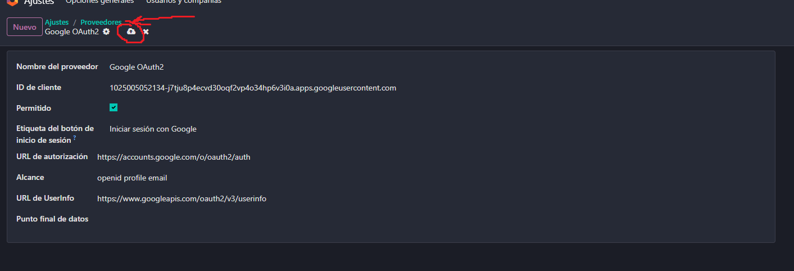

# 05 — Integración con Gmail

## Requisitos
- Cuenta Google Cloud (GCP).

## Pasos resumidos

1. **Activar plugin de correo**

Lo primero que tenemos que hacer es activar el plugin de correo desde Odoo. Para esto nos vamos a la pestaña de ajustes generales que hemos visto antes, bajamos a la sección de integraciones y marcamos la casilla de Plugin de correo. Le damos a guardar cambios en la esquina superior izquierda.  

  

Ahora vamos a ir a nuestro correo electrónico, una vez dentro en la barra que sale a la derecho le damos al más y buscamos la aplicación Odoo Inbox Addin.  

  

  

Podemos abrir esta aplicación de gmail cuando tenemos un correo abierto y nos saldrá un botón de login. Lo pulsamos, introducimos la URL de nuestra base de datos e iniciamos sesión.  

  

Con este plugin podremos ver información sobre la empresa que nos manda correos electrónicos.  

2. **Vincular con gmail**

Vamos a los ajustes generales, sección de integraciones y activamos Autenticación OAuth. Le damos a guardar cambios.  

  

Abrimos esta opción y seleccionamos Google OAuth2, vamos a necesitar una ID de cliente, para esto iremos a la Google Cloud Console.  

  

Dentro de Google Cloud Console buscamos Gmail API. Le damos a Habilitar  

  

Una vez habilitada le damos a crear credenciales.  

  

Le damos a Datos de los usuarios y siguiente.  

  

Como nombre de aplicación ponemos odoo-email, introducimos nuestro correo y siguiente.  

  

En agregar o quitar permisos buscamos gmail y marcamos los que sean necesarios, como por ejemplo leer correos o enviar correos a tu nombre, le damos a actualizar y continuar.  

  

Seleccionamos aplicacion web, de nombre ponemos nuevamente odoo-email y en URLs de redireccionamiento autorizados ponemos la url de nuestro Odoo con el añadido /google_gmail/confirm.  

  

Si ahora vamos a la pantalla de credenciales y seleccionamos la cuenta que hemos creado podremos ver y copiar nuestro Cliente ID y nuestro secreto de cliente.  

  

Ahora volvemos a Odoo, pegamos la ID del cliente y marcamos la casilla Permitido y le damos a guardar cambios.  

  

Si vamos a ajustes generales, en el apartado de Correos electrónicos, si tenemos marcada la opción Utilizar servidores de correo electrónico personalizados nos saldrá una nueva opción: Usar un servidor de Gmail. Aqui tenemos que poner nuestro ID y secreto de cliente.  

  

De esta forma el correo electrónico ya está vinculado a Odoo y podemos manejarlo desde dentro de Odoo.  
