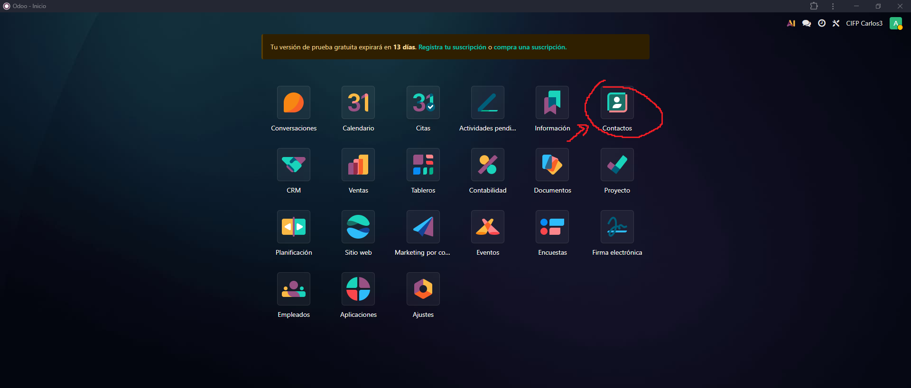
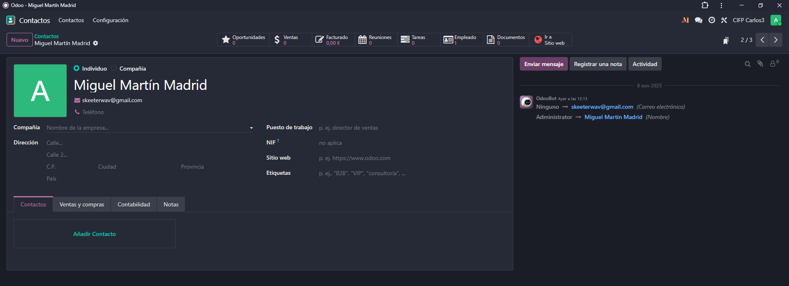
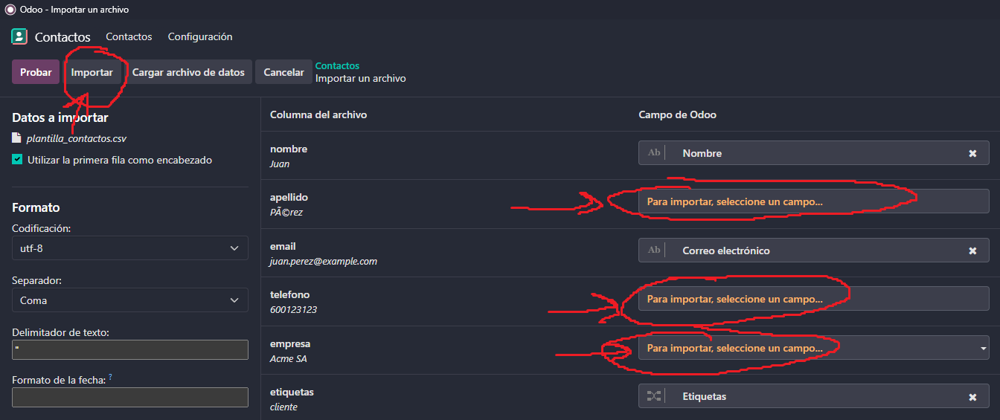

# 06 — Contactos

## Información de los contactos

Vamos a abrir la aplicación de contactos desde el panel de control.  

  

Aquí nos aparece una lista con todos nuestros contactos. Si hacemos click a uno de ellos podremos ver toda su información, como el número de oportunidades asociadas al contacto, las ventas, el dinero facturado, el número de reuniones o tareas asociadas o a que compañía pertenece.  

  

Existen contactos de empresa como de persona y Odoo reconoce automáticamente de que tipo es el contacto y los asocia entre sí.  

Si seleccionamos un contacto y hacemos click en acciones, podemos hacer varias cosas como exportarlo, insertarlo en una hoja de cálculo, archivarlo, eliminarlo, fusionarlo con otro contacto, enviarle un correo electrónico, otorgarle acceso a nuestro portal de Odoo, etc.

**Ojo:** Si no quieres que un contacto se muestre en tu lista de contactos es más conveniente archivarlo que eliminarlo, ya que una vez eliminado no se podrá recuperar.  

  

## Etiquetas  

Odoo nos permite asignar etiquetas para poder filtrar los contactos como queramos, y es una buena práctica usarlas ya que si llegamos a tener muchos contactos nos ayudará a encontrar los que estamos buscando de manera rápida y sencilla. Para añadir una etiqueta simplemente entramos al contacto y en la información donde pone Etiquetas escribimos la etiqueta que queremos darle y la creamos si no existe.  

  

## Importación CSV

Para importar contactos vamos a darle al engranaje al lado de Contactos en la esquina superior izquierda y le daremos a Importar registros.  

  

Podemos o bien arrastrar el archivo o darle a Subir archivo y seleccionarlo desde el buscador.  

  

Es posible que tengamos que configurar manualmente algunos de los campos a importar si Odoo no los reconoce automáticamente. Cuando estén todos configurados le damos a Importar arriba a la izquierda y se importará el/los contactos.  

  