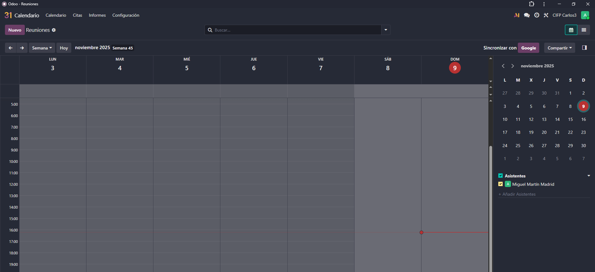
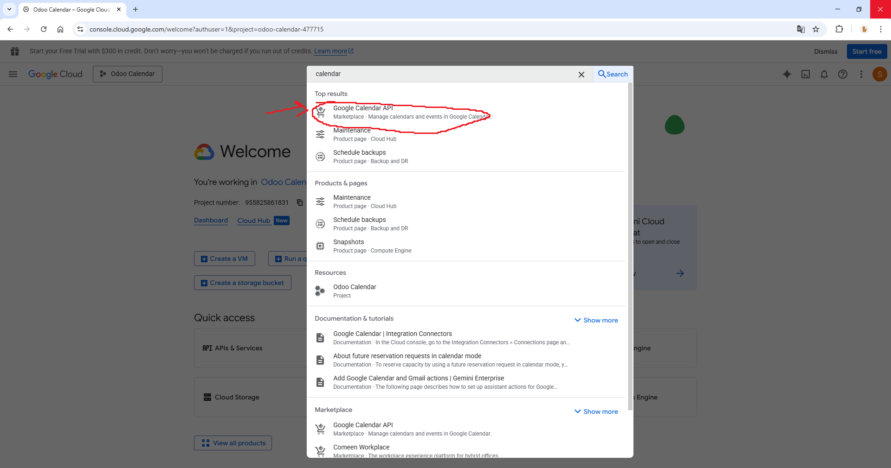
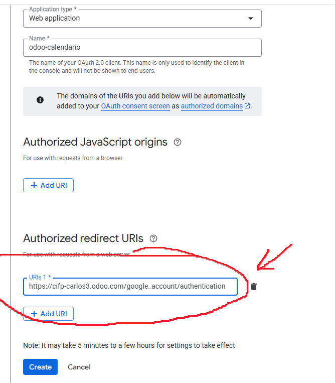
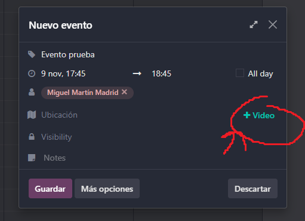

# 07 — Calendario y Citas

## Calendario y disponibilidad del equipo

Vamos a entrar al módulo de calendario desde el panel de control.  

  

Una vez dentro podemos cambiar si queremos verlo por semana, mes o año y podríamos ver todos nuestros eventos. También permite ver los calendarios de otras personas para comprobar su disponibilidad.  

  

## Integración con Google Calendar

Como ya hicimos en la [integración con gmail](05-integracion_gmail.md), vamos a ir a Google Cloud Console. En un nuevo proyecto, buscamos Google Calendar API y le damos a Enable.  

  

Esperamos a que se active y le damos a Create credentials, como hicimos con la API gmail.  

  

Los dos primeros pasos son igual que la otra vez, Datos de los usuarios, nombre de aplicación y nuestro correo electrónico.  

Esta vez en permisos activaremos openid y todos los permisos relacionados con Google Calendar API.  

  

  

La marcamos como aplicación web y en URLs de redireccionamiento autorizado ponemos nuestra URL de Odoo con el añadido /google_account/authentication.  

  

Nos vamos a los credenciales y ya tenemos nuevamente nuestro Client ID y nuestro secreto de cliente. Vamos a ir a los ajustes de Odoo, abriremos los ajustes del módulo de Calendario y los introduciremos donde pone Google Calendar.  

  

## Odoo meet

Si damos click sobre el calendario podemos crear un evento. Podemos asignarle participantes, ajustar la visibilidad (público o privado), añadir una ubicación, ponerle notas, y lo más importante: añadir el enlace a una videollamada. Esta puede ser externa con Google Meet u otras plataformas pero Odoo ofrece su propio servicio de reuniones: Odoo Meet. Si le damos click donde pone Video se nos crea un enlace a Odoo Meet.  

  

Una vez creado podemos usar el enlace para acceder a la videollamada.  

## Módulo citas

El módulo de citas es un módulo que viene solo con Odoo Enterprise y es muy útil si ofrecemos servicios de consultoría o cualquier servicio donde ofrecemos servicios a una hora concreta.  

Por ejemplo, creamos una cita del tipo reunión y podemos asignarsela a una persona, configurándola como citas de 1 hora, y compartir un enlace en el que la gente puede pedir una cita con la persona que hemos asignado.  

  
