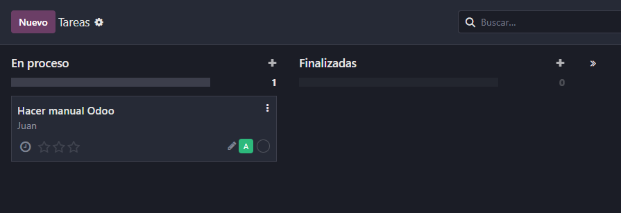
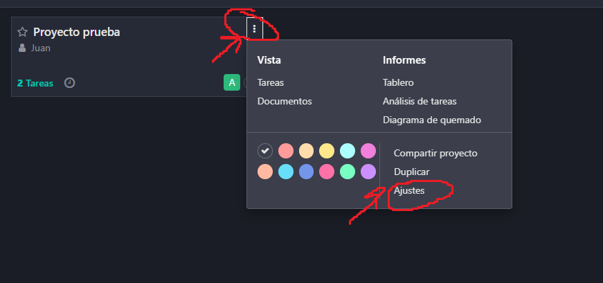
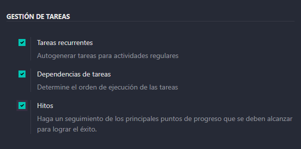
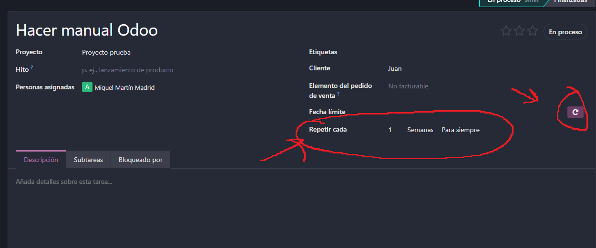
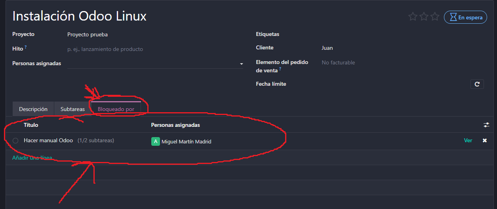
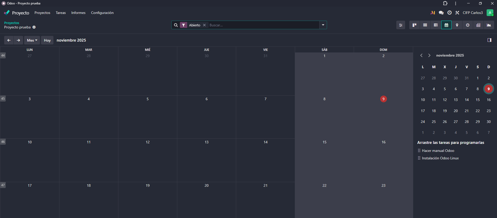

# 08 — Proyectos

## Proyectos, etapas, tareas y subtareas

Vamos a entrar a la aplicación de Proyectos y a crear un proyecto. A la hora de crearlo podemos marcar si es facturable o no y si lo es asignarle un cliente.  

  

Cuando entramos al proyecto creado podemos añadir etapas para las tareas, por ejemplo tareas en proceso o finalizadas. Dentro de cada etapa podemos crear tareas que asignaremos a diferentes personas de nuestra empresa.  

  

Si entramos a la tarea, podemos crear subtareas en las que se divide. Esto nos sirve para divider tareas más largas y complejas en pasos más sencillos e intuitivos.  

  

## Tareas recurrentes, dependencias e hitos

Para activar estas opciones debemos ir a las opciones de nuestro proyecto y activarlas.  

  

Le damos a la pestaña Ajustes, bajamos a la sección Gestión de tareas, activamos las tres opciones y guardamos los cambios.  

  

Si vamos a la tarea ahora aparecerá un símbolo de una flecha circular. Si la marcamos la tarea será una tarea recurrente y podemos configurar cada cuanto tiempo hay que repetirla.  

  

Para hacer una tarea dependiente de otra, vamos a la pestaña que pone Bloqueado por, y ahí podemos seleccionar que tareas deben ser realizadas antes de terminar esta.  

  

Los hitos del proyecto son puntos clave que se han realizado, por ejemplo la creación de una página web completada. Podemos acceder a ellas haciendo click en los tres puntos al lado de nuestro proyecto y abriendo la sección Hitos.  

  

## Vistas: tarjetas, lista, calendario propio

La vista por defecto para las tareas es que aparezcan como tarjetas, similar a herramientas como Trello, pero podemos cambiar la vista para que se vean como listas si lo preferimos.  

  

Otra de las vistas que podemos usar es la vista de calendario, en la que podemos ver las tareas con las fechas límites en un calendario. Este calendario es único para el proyecto, ya que no existe un claendario que combine todos los módulos en Odoo.  

  

## Análisis de tareas y calificación del cliente  

En la barra de arriba, en la sección de informes tenemos dos opciones: Análisis de tareas, que muestra un gráfico sobre todas las tareas de nuestro proyecto, y Calificaciónh de clientes, que nos permite recibir feedback de los clientes, cosa que puede resultar muy útil para hacer una valoración de nuestro trabajo.  

  
