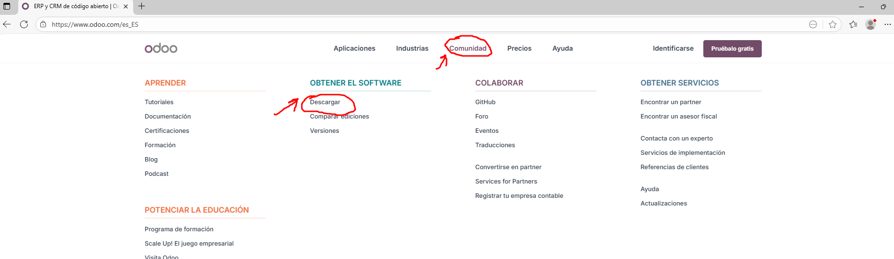
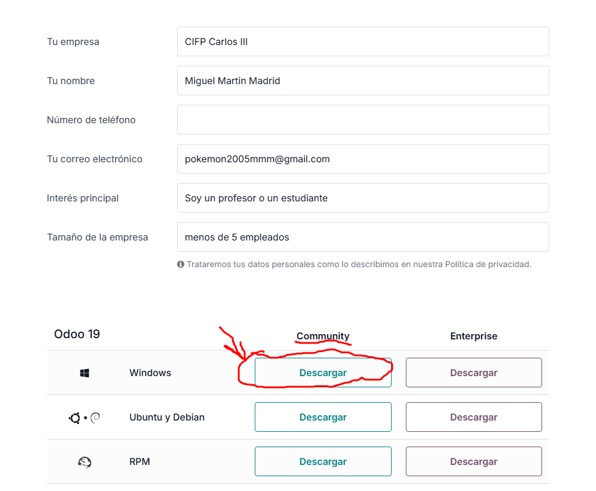

# 03 — Descarga del instalador de Odoo

## Instalar desde la web de Odoo  

Para localizar las descargas de Odoo local, vamos a entrar en la página web de Odoo, haremos click donde pone Comunidad, y dentro de la sección Obtener el software vamos a darle a Descargar.  

  

Rellenamos con nuestros datos y vamos a seleccionar la versión Community para Windows de Odoo 19.  

  

Nos debería quedar un archivo llamado `Odoo_setup_<version>`  

  