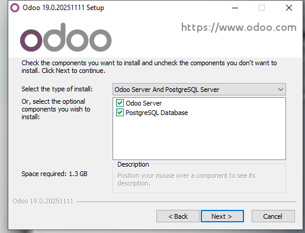

# 04 — PostgreSQL en Windows

Para poder utilizar Odoo necesitamos una base de datos. En concreto las bases de datos de Odoo son de PostgreSQL. Por suerte, en la instalación que estamos usando se instala PostgreSQL automáticamente, por lo que no necesitamos descargarlo previamente.  

  
