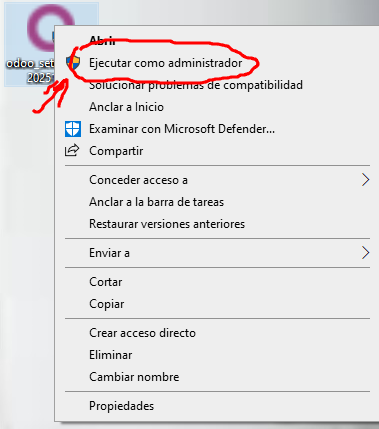
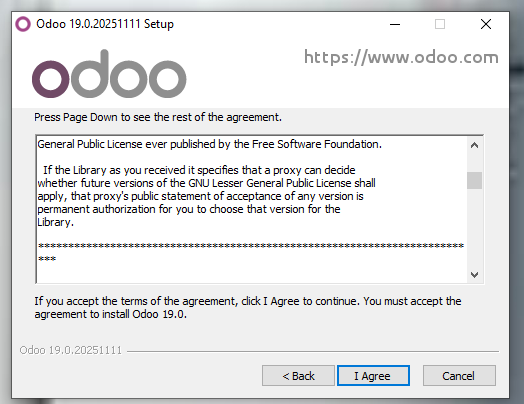
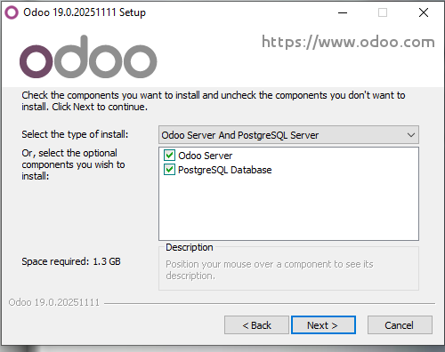
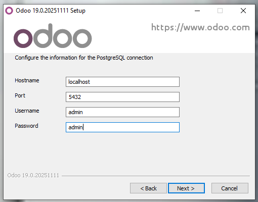
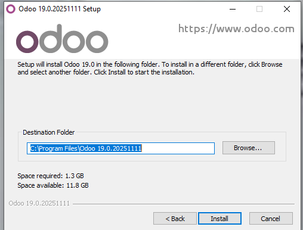

# 05 — Instalación de Odoo

Vamos a proceder con la instalación, para ejecutar el instalador le hacemos click derecho y lo ejecutamos como administrador.  

  

Nos pedirá elegir el idioma, nos saldrá que estamos en el instalador, le damos siguiente y a continuación saldrá la licencia. La leemos y la aceptamos.  

  

Lo siguiente que nos sale es lo que vamos a instalar. Es **MUY IMPORTANTE** que marquemos instalar PostgreSQL, ya que es necesario para usar Odoo.  

  

Ahora tendremos que configurar la conexión de PostgreSQL, elegimos un puerto que no esté ocupado y nuestro usuario y contraseña.  

  

Por último le decimos la ruta de instalación.  

  

Esperamos a que rermine la instalación y finalizamos el asistente.  