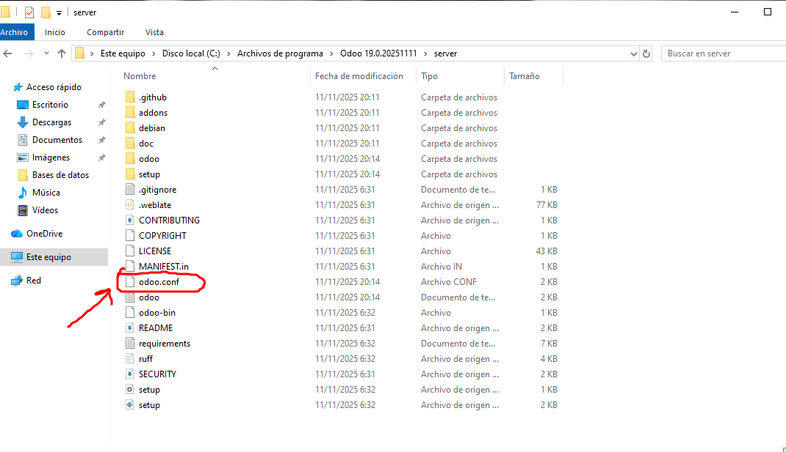
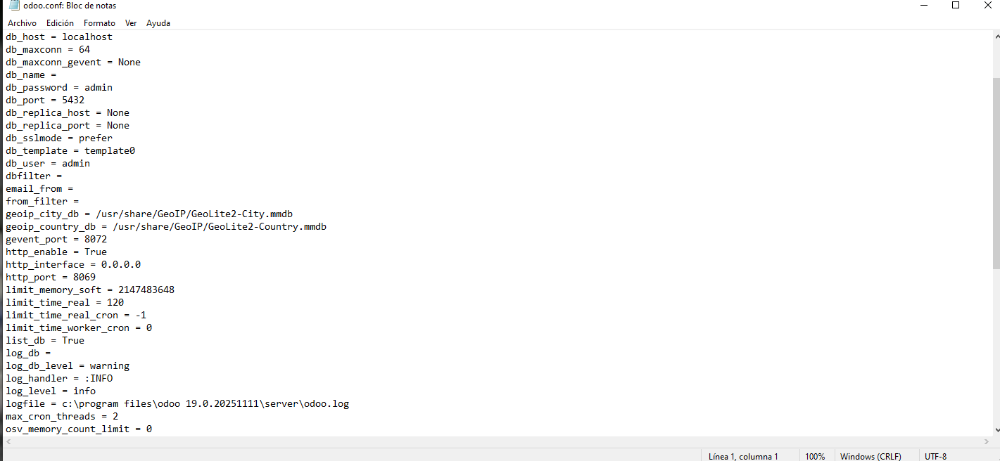

# 06 — Configuración inicial

Los archivos de configuración de Odoo están dentro de la carpeta server. Para configurar el puerto el archivo al que tenemos que acceder es odoo.conf.  

  

Para poder editarlo vamos a ejecutar el bloc de notas como administrador y abriremos el archivo desde el bloc de notas.  

Podemos cambiar muchas cosas en este archivo, por ejemplo, para cambiar el puerto modificaríamos http_port.  

  

El puerto por defecto es el 8069, por lo que el enlace para acceder sería `http://localhost:8069`.  