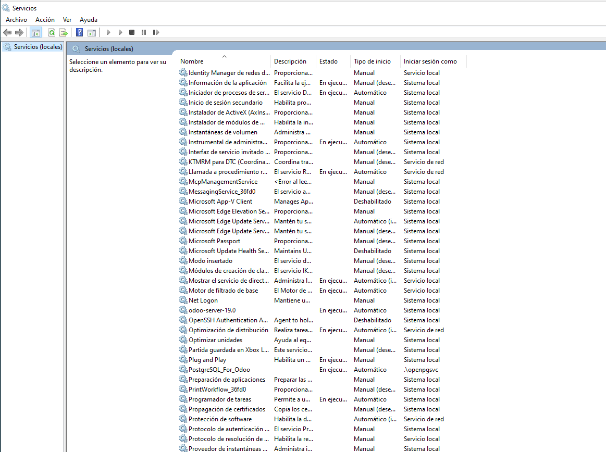
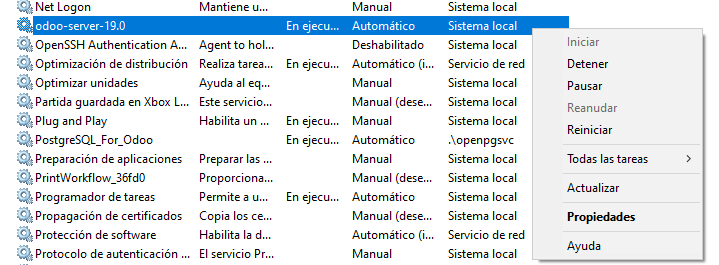

# 07 — Ejecución y servicio

Para comprobar que el servicio está inicializado, vamos ir al administrador de servicios de Windows presionando la tecla Windows y buscando servicios. En esta pestaña podemos ver si el servicio odoo-server-19.0 está en ejecución o no.  

  

Si damos click derecho sobre el servicio podemos detenerlo o configurar si se incia automáticamente o manualmente, o si estuviera apagado podríamos arrancarlo.  

  