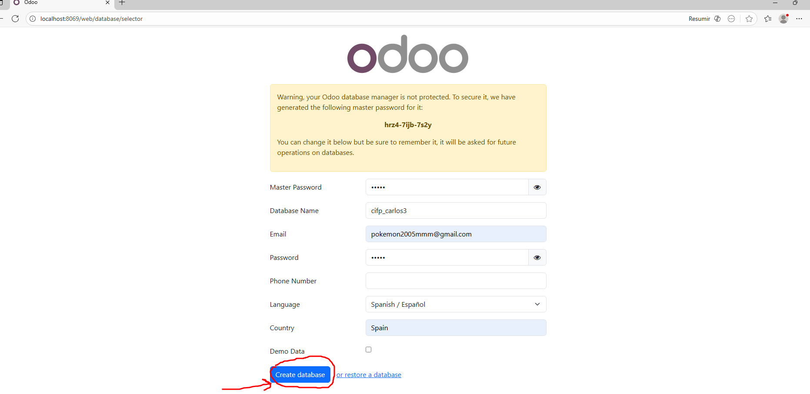
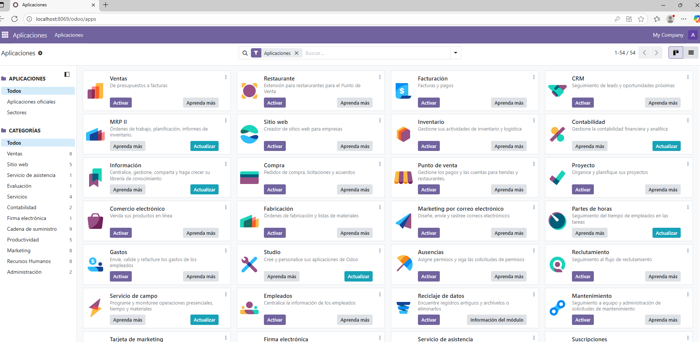

# 08 — Creación de base de datos de prueba

Vamos a acceder a Odoo escribiendo el enlace `http://localhost:8069` en nuestro navegador, o en caso de que hayamos elegido otro puerto, pues cambiamos en enlace al del puerto.  

Creamos una base de datos nueva introduciendo los datos necesarios y le damos a Crear base de datos.  

  

Esperamos unos minutos y cuando se cree podemos elegir una aplicación para instalar.  

  